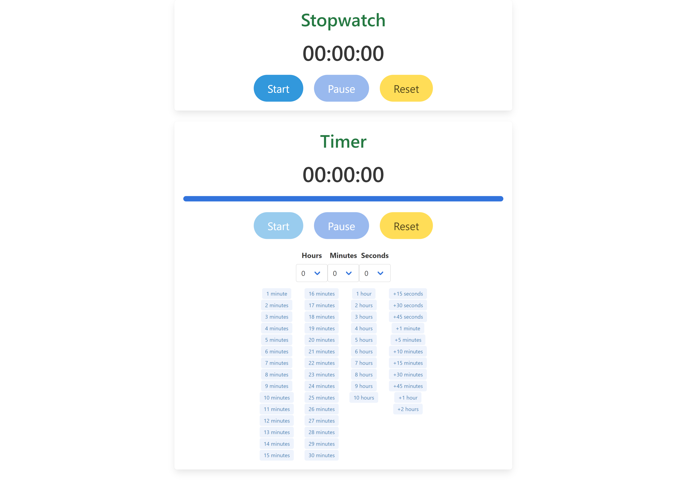

# Tyme

A simple stopwatch and timer app built with the Yew framework in Rust.

## Screenshot



## Build and run

With Docker:

```bash
podman build . -t tyme
podman run -p 8080:8080 --name tyme_container tyme
```
